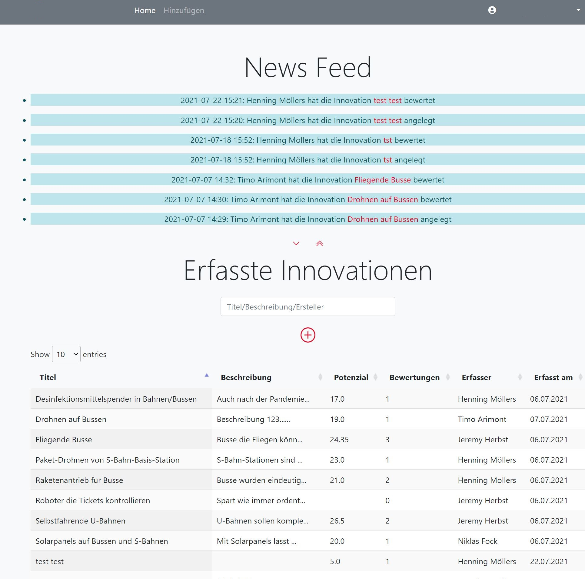
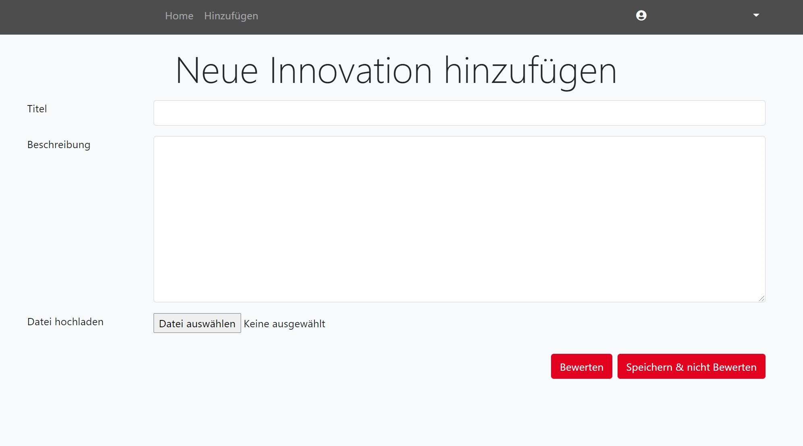
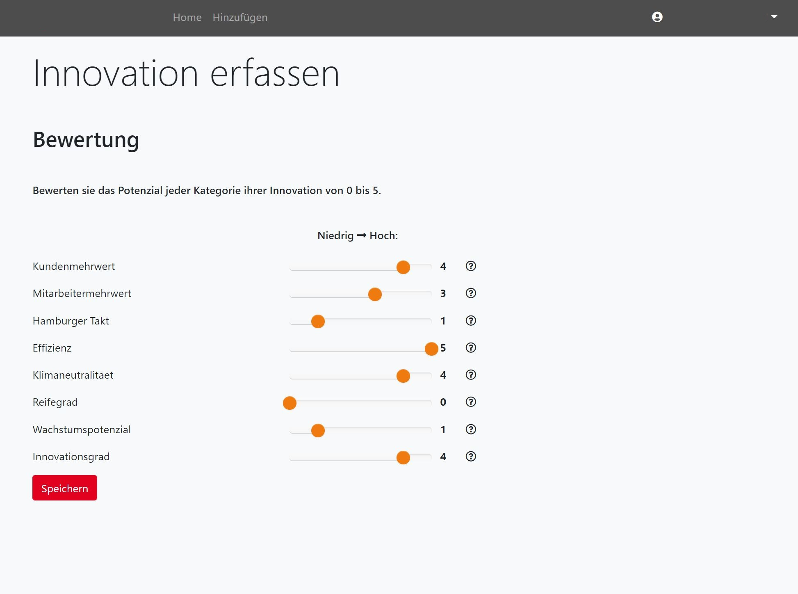
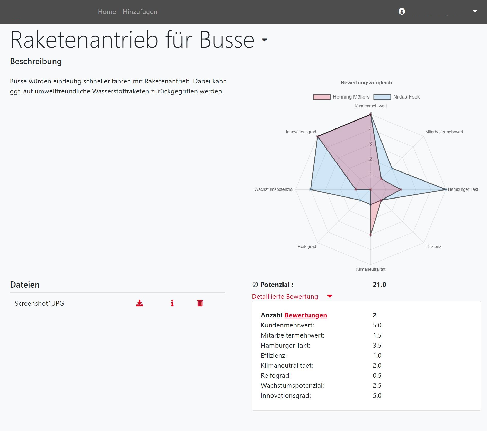

<!--
*** Copied from https://github.com/othneildrew/Best-README-Template
-->


<!-- PROJECT LOGO -->
<br />
<p align="center">
  <a href="https://github.com/8harsman/InnoWeb">
    
  </a>

  <h3 align="center">InnoWeb</h3>

</p>


<!-- TABLE OF CONTENTS -->
<details open="open">
  <summary>Table of Contents</summary>
  <ol>
    <li>
      <a href="#about-the-project">About The Project</a>
      <ul>
        <li><a href="#built-with">Built With</a></li>
      </ul>
    </li>
    <li>
      <a href="#getting-started">Getting Started</a>
      <ul>
        <li><a href="#prerequisites">Prerequisites</a></li>
        <li><a href="#installation">Installation</a></li>
      </ul>
    </li>
    <li><a href="#usage">Usage</a></li>
    <li><a href="#roadmap">Roadmap</a></li>
    <li><a href="#contributing">Contributing</a></li>
    <li><a href="#license">License</a></li>
    <li><a href="#contact">Contact</a></li>
    <li><a href="#acknowledgements">Acknowledgements</a></li>
  </ol>
</details>


<!-- ABOUT THE PROJECT -->
## About The Project


This project is the result of collaboration between the base.camp(University of Hamburg) and a partner company.
The goal of the project is to create a web application, which perfectly fits the innovation management process of the partnered company. It is obvious that the web app is also applicable for innovation management processes in other enterprises. 

The functionality of the web app is based on excel spread sheets, which were used by said company.

### Built With

<!-- This section should list any major frameworks that you built your project using. Leave any add-ons/plugins for the acknowledgements section. Here are a few examples.-->
* [Bootstrap](https://getbootstrap.com)
* [JQuery](https://jquery.com)
* [Spring Boot](https://spring.io/projects/spring-boot)
* [Thymeleaf](https://www.thymeleaf.org/)
* [MySQL](https://www.mysql.com/)


<!-- GETTING STARTED -->
## Getting Started

<!-- This is an example of how you may give instructions on setting up your project locally.-->
To get a local copy up and running follow these simple example steps.

### Prerequisites

<!-- This is an example of how to list things you need to use the software and how to install them.-->
* MySQL database required

### Installation

1. Clone the repo:
   ```sh
   git clone https://github.com/8harsman/InnoWeb.git
   ```
2. Setup connection to Database: <br /><br />
In the file `application.properties` you need to define `spring.datasource` entering the username, password and url for your database.
There is no further setup for the database needed (e.g. specifying tables) as the database structure will be created automatically by the persistence-framework `Hibernate` in the java code.
   
3. Local start up: <br /><br />
To start the website on your localhost you should be already good to go. Just run the `main` method in the `InnoWebApplication` class. 

4. Deployment: <br /><br />
For a deployment on a webserver you need to change a few lines of code concerning the `Spring Framework`. You can easily execute these changes, merging your customized Version of the `master`-branch into the `Deployment2`- branch, which has the necessary code changes implemented. Afterwards you just need to package the project to the file type of your choice (using the IntelliJ IDE you should enable the "Skip Test" mode). We used a `war`-file to deploy the web app on an `apache tomcat web server`. Then upload the packaged file to your web server and instruct your web server to deploy the website. 

### Styling with css/scss

To customize the default Bootstrap Theme the Bootstrap sourcefiles were included in this Project under src/main/resources/static/bootstrap. The Sass color variables of the Bootstrap Theme are overridden in the src/main/resources/static/scss/custom.scss which also include every other css/scss code used in this project. During the maven goal generate-resources this custom.scss as well as the Bootstrap sources are compiled to src/main/resources/static/generated/css/styles.css which is then included in the header of the HTML files.

<!-- USAGE EXAMPLES -->
## Usage

<!-- Aus meiner Sicht reichen hier einfach ein paar verschiedene Screenshots mit kurzer Beschreibung -->

<!-- Use this space to show useful examples of how a project can be used. Additional screenshots, code examples and demos work well in this space. You may also link to more resources.-->
Create new innovation ideas.
<p align="center">

  
</p>
Rate you innovation ideas.
<p align="center">

  
</p>
Compare ratings, attach files, describe your innovation idea.
<p align="center">

   
</p>
Get an overview about your innovation management.
<p align="center">

   
</p>


<!-- CONTRIBUTING -->
## Contributing

Contributions are what make the open source community such an amazing place to be learn, inspire, and create. Any contributions you make are **greatly appreciated**.

1. Fork the Project
2. Create your Feature Branch (`git checkout -b feature/AmazingFeature`)
3. Commit your Changes (`git commit -m 'Add some AmazingFeature'`)
4. Push to the Branch (`git push origin feature/AmazingFeature`)
5. Open a Pull Request


<!-- LICENSE -->
## License

Distributed under the to be determinded. See `LICENSE` for more information.


<!-- CONTACT -->
## Contact

Anna Tomko - anna.tomko@studium.uni-hamburg.de
Niklas Fock - niklas.fock@studium.uni-hamburg.de
Keno Harsman - jan.keno.harsman@studium.uni-hamburg.de
Jeremy Herbst - jeremy.herbst@studium.uni-hamburg.de
Henning Möllers - henning.moellers@studium.uni-hamburg.de

Project Link: [https://github.com/8harsman/InnoWeb](https://github.com/8harsman/InnoWeb)


<!-- ACKNOWLEDGEMENTS -->
## Acknowledgements
* [README template](https://github.com/othneildrew/Best-README-Template)
* [Choose an Open Source License](https://choosealicense.com)
* [Chart.js](https://www.chartjs.org/)
* [Bootstrap-slider.js](https://github.com/seiyria/bootstrap-slider)
* [bootstrap-datepicker](https://bootstrap-datepicker.readthedocs.io/en/latest/)
* [Project Lombok](https://projectlombok.org/)
* [jQuery UI](https://jqueryui.com/)
* [DataTables](https://datatables.net/)


<!-- MARKDOWN LINKS & IMAGES -->
<!-- https://www.markdownguide.org/basic-syntax/#reference-style-links -->
[product-screenshot]: images/screenshot.png
